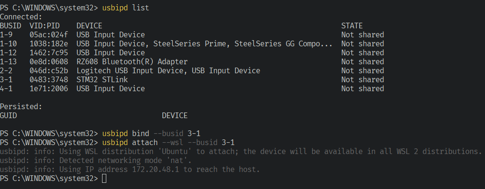
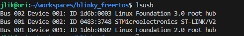
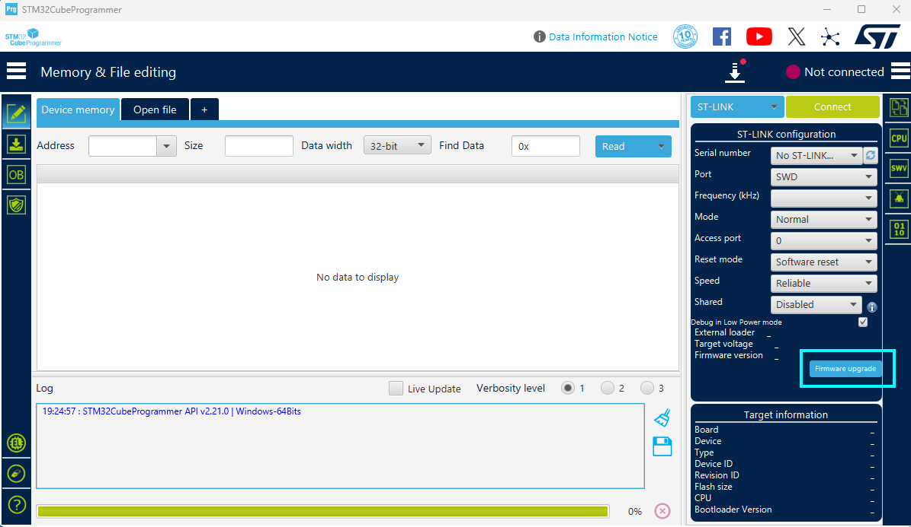

https://www.freertos.org/Community/Blogs/2021/using-visual-studio-code-for-freertos-development

VSCode Extensions Required
1) C/C++
2) Cortex-Debug
3) STM32Cube

Setup and Project Creation in WSL
1) Download cmake and ninja-build
2) Download STM32Cube extension for VSCode
3) Download STM32CubeMX for Linux
4) Use the STM32Cube extension to create a new project with STM32CubeMX.
- Include FreeRTOS as middleware
- Select CMake as the toolchain
5) Download arm-none-eabi-gcc
- Add the path to arm-none-eabi-gcc to your path: export PATH="<path_to_gcc>:$PATH"
6) Update .vscode/c_cpp_properties.json file
- https://www.freertos.org/Community/Blogs/2021/using-visual-studio-code-for-freertos-development
- The first thing you will want to do is update the intelliSenseMode variable to be gcc-arm and provide your cross compiler in the compilerPath variable.
- Copy the INCLUDE list from the STM32CubeMX generated Makefile this into the includePath array in the c_cpp_properties.json file. Prefix each folder location with ${workspaceFolder}
- Add the path to arm-none-eabi-gcc in c_cpp_properties.json
```
export PATH="/opt/gcc-arm-none-eabi-10.3-2021.10/bin:$PATH"
arm-none-eabi-gcc --version
```

Building the Project
1) Ctrl + Shift + P -> Choose CMake: Configure
2) Then Ctrl + Shift + P -> Choose CMake: Build

Connecting USB Devices to WSL
1) Download STLink driver https://www.st.com/en/development-tools/stsw-link009.html 
2) Downloading usbipd for sharing USB devices with wsl: https://learn.microsoft.com/en-us/windows/wsl/connect-usb
- `usbipd list`
- `usbipd bind --busid 3-1`
- `usbipd attach --wsl --busid <busid>`
- 
3) You should be able to see the STLink in wsl
- 
4) Create udev rules for STLink permissions
- `sudo vim /etc/udev/rules.d/49-stlink.rules`
- Copy paste the following:
```
# STMicroelectronics ST-Link
# you can obtain the vendor id and product id from `lsusb`
SUBSYSTEM=="usb", ATTR{idVendor}=="0483", ATTR{idProduct}=="3748", MODE="0666"
SUBSYSTEM=="usb", ATTR{idVendor}=="0483", ATTR{idProduct}=="374b", MODE="0666"
SUBSYSTEM=="usb", ATTR{idVendor}=="0483", ATTR{idProduct}=="3752", MODE="0666"
SUBSYSTEM=="usb", ATTR{idVendor}=="0483", ATTR{idProduct}=="3753", MODE="0666"
```
- Then:
- `sudo udevadm control --reload-rules`
- `sudo udevadm trigger`
5) Update STLink programmer if required
- Download STM32CubeProgrammer
- Use STM32CubeProgrammer to update the STLink programmer
- 

Running and Debugging
1) Go to Arm Cortex tools extension -> Choose create launch.json file
2) Choose STM32Cube: STLink GDB Server when prompted
- A launch.json file will be created
